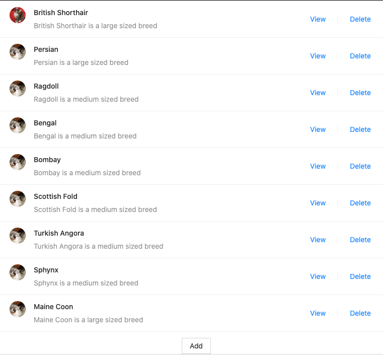
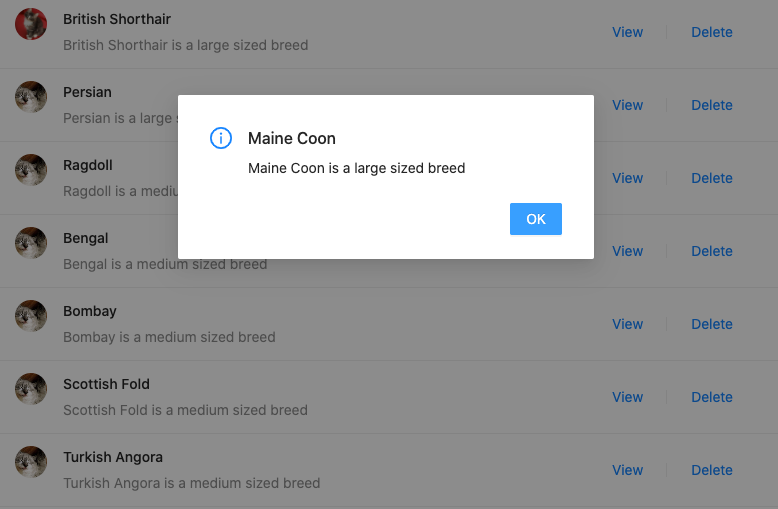
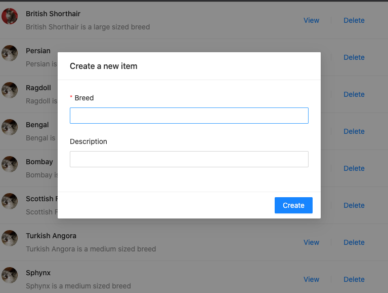

# Keet Health QA Engineer Questions

**Objectives**:

- Read the following 2 scenarios
- Write your response in a text file and send back through email.

### Scenario 1

You are given 3 mock-ups displaying the capabilities of a basic app that lists cat breeds.  
 You are not given requirements, acceptance criteria, or any other information - just these 3 images.

1.  List Cat Breeds.  
    
2.  View a specific breed.  
    
3.  Add a breed to the list.  
    

- What are immediate questions that come to mind before you even get to test it?
  What are some potential bugs?
- Go over how you would test this
- List any concerns and suggestions on how you would make the pages better.

### Scenario 2

After you raised some concerns, someone uploaded the video titled [`cats-bug.mp4`](cats-bug.mp4), with the following message:

> BUG! Deleting last item in list leads to unexpected behavior.

- Confirm what you are seeing is a bug
- Identify failure points
- Write a sample bug report based on the video - be as detailed as you can
- List any other information that could be useful to make your bug report better.
